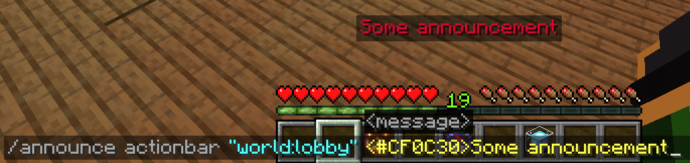
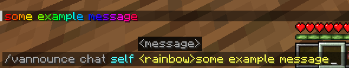
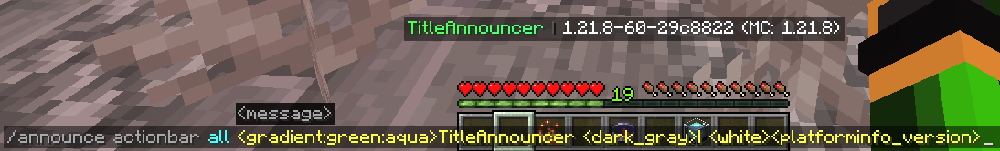
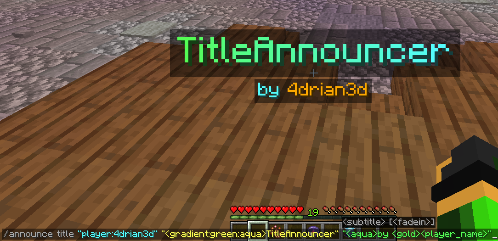
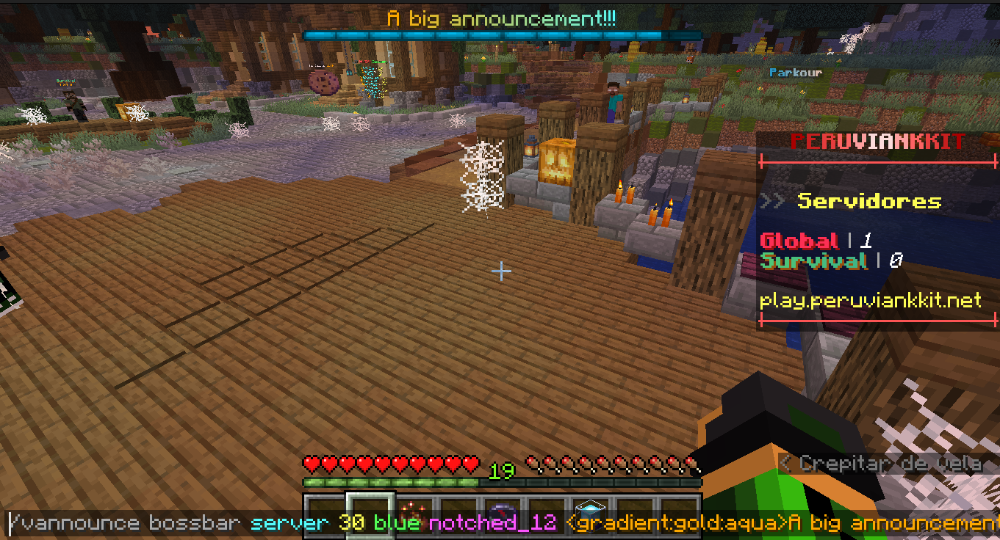

# TitleAnnouncer

A lightweight plugin to send Titles, Actionbars, Bossbars and Chat Announces to Paper servers and Velocity networks.

## Features
- Ability to send announcements by using titles, actionbars, bossbars, and chat messages.
- Send announcements to users in the same world or server you are in.
- Send announcements to a specific user.
- Use of the [MiniMessage format](https://docs.adventure.kyori.net/minimessage.html#format) throughout the plugin, allowing the maximum possible customization.
- [MiniPlaceholders](https://modrinth.com/plugin/miniplaceholders) support

## Commands

To use the commands in Velocity, just add a "v" at the beginning of the command, for example: "/vannounce" or "/vtitleannouncer".

### Announce Command

| Command                 | Arguments                                                                                      | Permission             |
|-------------------------|------------------------------------------------------------------------------------------------|------------------------|
| /announce or /vannounce | [\(Format type\)](#format-argument) [\(Target Argument\)](#target-argument) (Format Arguments) | titleannouncer.command |

## Arguments

### Target Argument

When sending an announcement, you can define who to send it to using the target argument.
This argument allows you to select either an online player or the executor themselves, a server, or a world to send the announcement to.
The available targets are:

#### Self Target

This target allows you to send the respective announcement to the same executor of the command.
Keep in mind that if the server console uses this target, it will not be able to receive bossbars, actionbars, titles, or sounds;
it will only be able to receive chat announcements

**Example Usage**

`/(v)announce chat self <rainbow>Some announcement`

#### Player Target

This target allows you to send an announcement to a specific player.

Use the format `“player:PlayerName”`.

As it is an argument that uses a colon character and due to limitations of the Minecraft Vanilla command system,
it must be enclosed in quotation marks.

If executed in-game, online player names will be suggested.

**Example Usage**

`/(v)announce title "player:4drian3d" "<gradient:green:aqua>TitleAnnouncer" "<aqua>by <gold>4drian3d"`

#### All Target

This target allows you to send an announcement to all players on the server or proxy.

If you run the command from TitleAnnouncer in Velocity, the announcement will be sent to all players on your network.
If you run it from TitleAnnouncer installed in Paper, the announcement will be sent to players connected to the server where it is run.

**Example Usage**

`/(v)announce actionbar all <gradient:green:aqua>TitleAnnouncer <dark_gray>| <white><platforminfo_version>`

#### Server Target

> [!NOTE]  
> This target is exclusive to Velocity

This target allows you to send an announcement to the specific server where the player executing it is connected, or to a specific server.

For the executor to send the announcement to the server where it is connected, you only need to place `server` as an argument.

But if the executor wants it to be executed on another server, it must be specified with the format `“server:ServerName”`.
Like the player argument, when requiring `:`, it must be enclosed in quotation marks.

**Example Usage**

`/vannounce bossbar server 30 blue notched_12 <gradient:gold:aqua>A big announcement!!!`

`/vannounce bossbar "server:lobby" 30 blue notched_12 <gradient:gold:aqua>A big announcement!!!`

#### World Target

> [!NOTE]  
> This target is exclusive to Paper

This target allows you to send an announcement to the world where the player executing the command is located or to a specified world.

If you want to send the announcement to the world where the player is located, you must use the `world` argument.

But if you want to specify another world, you must use the `“world:WorldName”` argument.
Like the player argument, when requiring `:`, it must be enclosed in quotation marks.

**Example Usage**

`/announce bossbar world 30 blue notched_12 <gradient:gold:aqua>A big announcement!!!`

`/announce bossbar "world:lobby" 30 blue notched_12 <gradient:gold:aqua>A big announcement!!!`

### Format Argument

#### Chat Format

| Arguments   | Permission                  |
|-------------|-----------------------------|
| \[Message\] | titleannouncer.command.chat |

#### Actionbar Format

| Arguments   | Permission                       |
|-------------|----------------------------------|
| \[Message\] | titleannouncer.command.actionbar |

#### Title Format

| Arguments                                                       | Permission                   |
|-----------------------------------------------------------------|------------------------------|
| \[Title\] \[SubTitle\] (FadeIn Time) (Stay Time) (FadeOut Time) | titleannouncer.command.title |

#### BossBar Format

| Arguments                                         | Permission                     |
|---------------------------------------------------|--------------------------------|
| \[Display Time\] \[Color\] \[Overlay] \[Content\] | titleannouncer.command.bossbar |

#### Sound Format

> [!IMPORTANT]  
> If running on Velocity, this format will only be able to send sounds to players with versions higher than 1.19.3.

| Arguments                                    | Permission                   |
|----------------------------------------------|------------------------------|
| \[Sound Key\] (Source Type) (Volume) (Pitch) | titleannouncer.command.sound |

